# INSARAG 標記圖解速查手冊

2027 版規則（2027-01-01 生效）｜A5 演習用｜2026-10-05 核對

中文採用 ASD-STE100 寫作原則；本冊不是官方中文版，也不宣稱英文 STE 合規或認證。

標有【2027 異動】的條目為 2027 版的變更；PDF 與 SVG 以淺藍底與藍色標籤標示。

## 01｜INSARAG 標記圖解

A5 隨身速查手冊｜先確認，再標記。

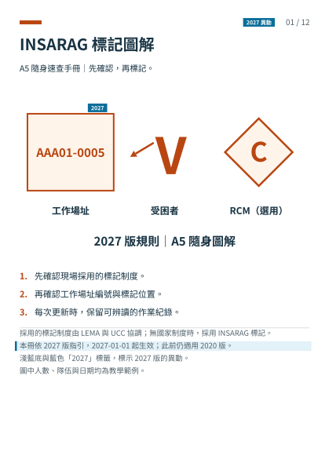

1. 先確認現場採用的標記制度。
2. 再確認工作場址編號與標記位置。
3. 每次更新時，保留可辨讀的作業紀錄。

採用的標記制度由 LEMA 與 UCC 協調；無國家制度時，採用 INSARAG 標記。
【2027 異動】本冊依 2027 版指引，2027-01-01 起生效；此前仍適用 2020 版。
淺藍底與藍色「2027」標籤，標示 2027 版的異動。
圖中人數、隊伍與日期均為教學範例。

來源：S5 標記系統；S4 版本公告。

## 02｜工作場址：標記位置與順序

在入口外側，選擇清楚可見的位置。

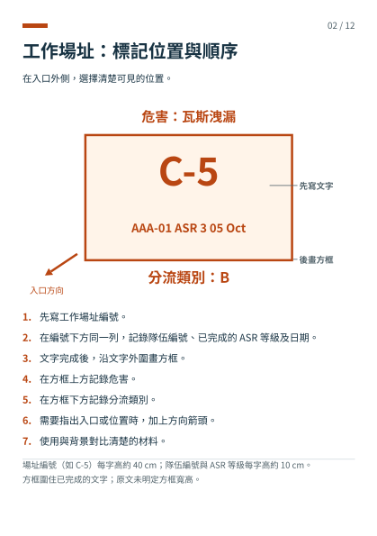

1. 先寫工作場址編號。
2. 在編號下方同一列，記錄隊伍編號、已完成的 ASR 等級及日期。
3. 文字完成後，畫方框圍住文字與下方的預留空白。
4. 在方框上方記錄危害。
5. 在方框下方記錄分流類別。
6. 需要指出入口或位置時，加上方向箭頭。
7. 使用與背景對比清楚的材料。

> ⚠ **注意**
>
> - 後續 ASR 等級可能由其他隊伍接手；每完成一級追加一列，換班不追加。
> - 畫方框時，為尚未完成的 ASR 等級預留空白列；此為演習提醒。

場址編號每字高約 40 cm；隊伍編號與 ASR 等級每字高約 10 cm。
【2027 異動】場址編號＝建立場址的隊伍編號＋4 位數；分區代碼由 ICMS 附加，不寫在標記上。
原指引方框約 1.2 至 1.0 公尺；編號較長時，依實際文字寬度畫框。

來源：S5 工作場址分流標記；S6 工作場址編號。

## 03｜工作場址：更新與結案

完成一次作業後，追加紀錄。

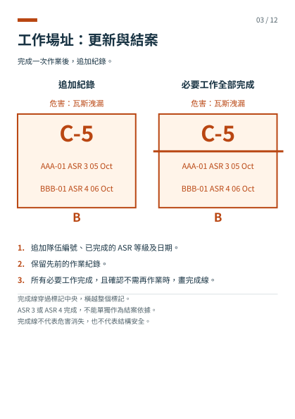

1. 追加隊伍編號、已完成的 ASR 等級及日期。
2. 保留先前的作業紀錄。
3. 所有必要工作完成，且確認不需再作業時，畫完成線。

【2027 異動】完成線畫在場址編號下方、ASR 紀錄上方，橫越整個標記。
【2027 異動】確定建物僅有罹難者時，標記只記錄 ASR 5 與完成線。
【2027 異動】隊伍編號為國碼 3 字母＋2 位數，例如 AAA01，不加連字號。
ASR 3 或 ASR 4 完成，不能單獨作為結案依據。
完成線不代表危害消失，也不代表結構安全。

來源：S5 工作場址分流標記與漸進範例；S6 隊伍編號格式。

## 04｜分流類別與 ASR 等級

分流類別表示評估結果；ASR 等級表示工作內容。

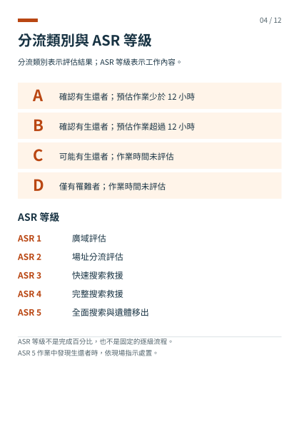

ASR 等級不是完成百分比，也不是固定的逐級流程。
ASR 5 作業中發現生還者時，依現場指示處置。

來源：S7 分流類別；S8 ASR 等級。

## 05｜受困者：位置與剩餘人數

在受困者位置附近的表面畫 V；需要時加方向箭頭。

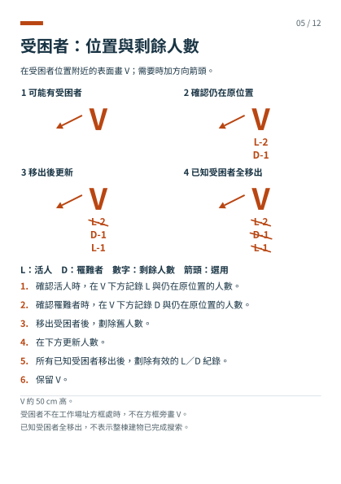

1. 確認生還者時，在 V 下方記錄 L 與仍在原位置的人數。
2. 確認罹難者時，在 V 下方記錄 D 與仍在原位置的人數。
3. 移出受困者後，劃除舊人數。
4. 在下方更新人數。
5. 所有已知受困者移出後，劃除有效的 L／D 紀錄。
6. 保留 V。

V 約 50 cm 高。
受困者不在工作場址方框處時，不在方框旁畫 V。
已知受困者全移出，不表示整棟建物已完成搜索。

來源：S5 受困者標記。

## 06｜RCM：快速清查標記

由 LEMA 決定是否採用 RCM。

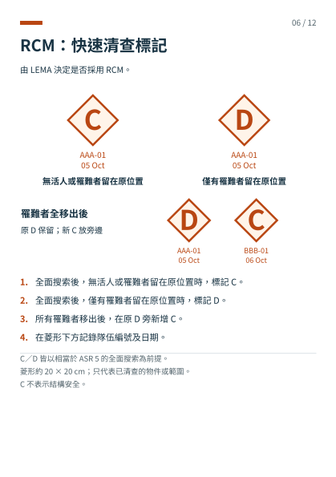

1. 全面搜索後，無生還者或罹難者留在原位置時，標記 C。
2. 全面搜索後，僅有罹難者留在原位置時，標記 D。
3. 所有罹難者移出後，在原 D 旁新增 C。
4. 在菱形下方記錄隊伍編號及日期。

C／D 皆以相當於 ASR 5 的全面搜索為前提。
菱形約 20 × 20 cm；只代表已清查的物件或範圍。
C 不表示結構安全。

來源：S5 快速清查標記。

## 07｜先統一建物面向

以街道地址所在的正面為第 1 面。

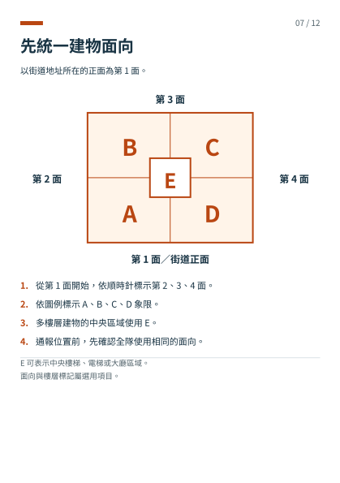

1. 從第 1 面開始，依順時針標示第 2、3、4 面。
2. 依圖例標示 A、B、C、D 象限。
3. 多樓層建物的中央區域使用 E。
4. 通報位置前，先確認全隊使用相同的面向。

E 可表示中央樓梯、電梯或大廳區域。
面向與樓層標記屬選用項目。

來源：S5 建物面向。

## 08｜樓層：先核對命名

Ground Floor 與臺灣常見的 1F 對應。

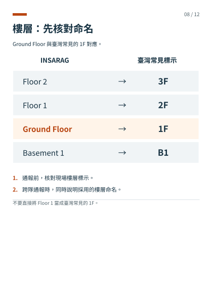

1. 通報前，核對現場樓層標示。
2. 跨隊通報時，同時說明採用的樓層命名。

不要直接將 Floor 1 當成臺灣常見的 1F。

來源：S5 建物面向（樓層）。

## 09｜警戒帶：辨識區域

先確認現場是否採用此警戒帶方式。

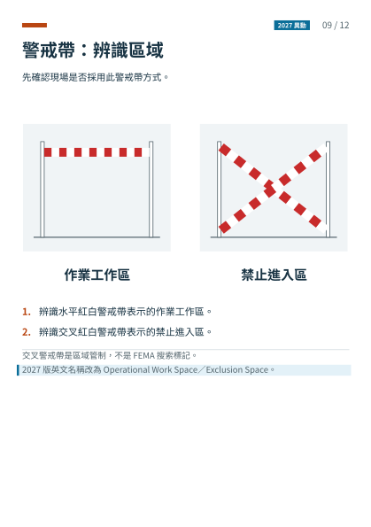

1. 辨識水平紅白警戒帶表示的作業工作區。
2. 辨識交叉紅白警戒帶表示的禁止進入區。

交叉警戒帶是區域管制，不是 FEMA 搜索標記。
【2027 異動】2027 版英文名稱改為 Operational Work Space／Exclusion Space。

來源：S5 警戒標記。

## 10｜號音：先聽懂，再作業

作業前，向所有隊伍說明採用的號音。

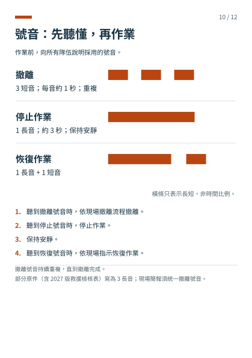

1. 聽到撤離號音時，依現場撤離流程撤離。
2. 聽到停止號音時，停止作業。
3. 保持安靜。
4. 聽到恢復號音時，依現場指示恢復作業。

撤離號音持續重複，直到撤離完成。
部分原件（含 2027 版救援檢核表）寫為 3 長音；現場簡報須統一撤離號音。

來源：S5 號音系統；S9 救援檢核表；S3 p.22。

## 11｜名詞速查：同一概念用同一詞

完整中英對照表另見 terminology.csv。

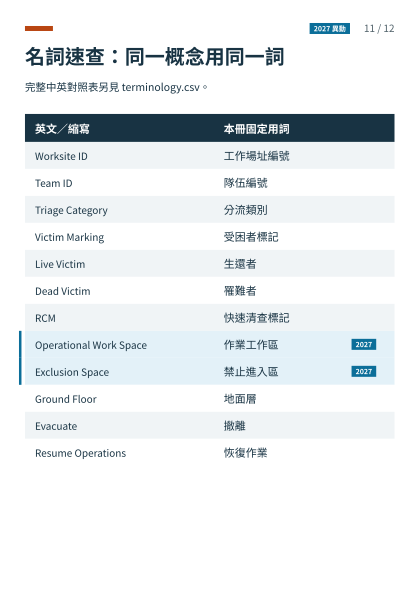

來源：S5–S8；STE Issue 9 §1、§5。

## 12｜出勤前核對與資料來源

依現場簡報完成下列核對。

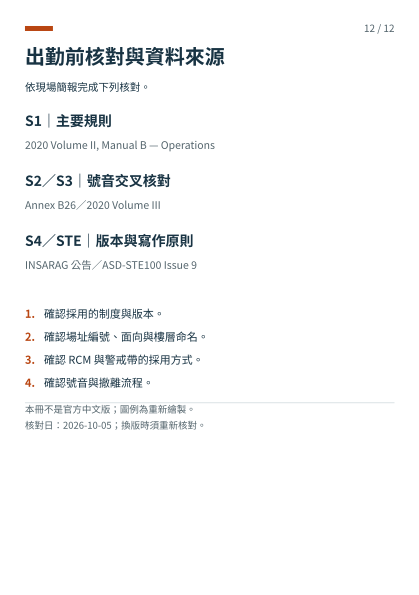

1. 確認採用的制度與版本。
2. 確認場址編號、面向與樓層命名。
3. 確認 RCM 與警戒帶的採用方式。
4. 確認號音與撤離流程。

本冊不是官方中文版；圖例為重新繪製。
核對日：2026-10-05；換版時須重新核對。

來源：核對日：2026-10-05｜來源與術語檢查紀錄隨冊附存。
