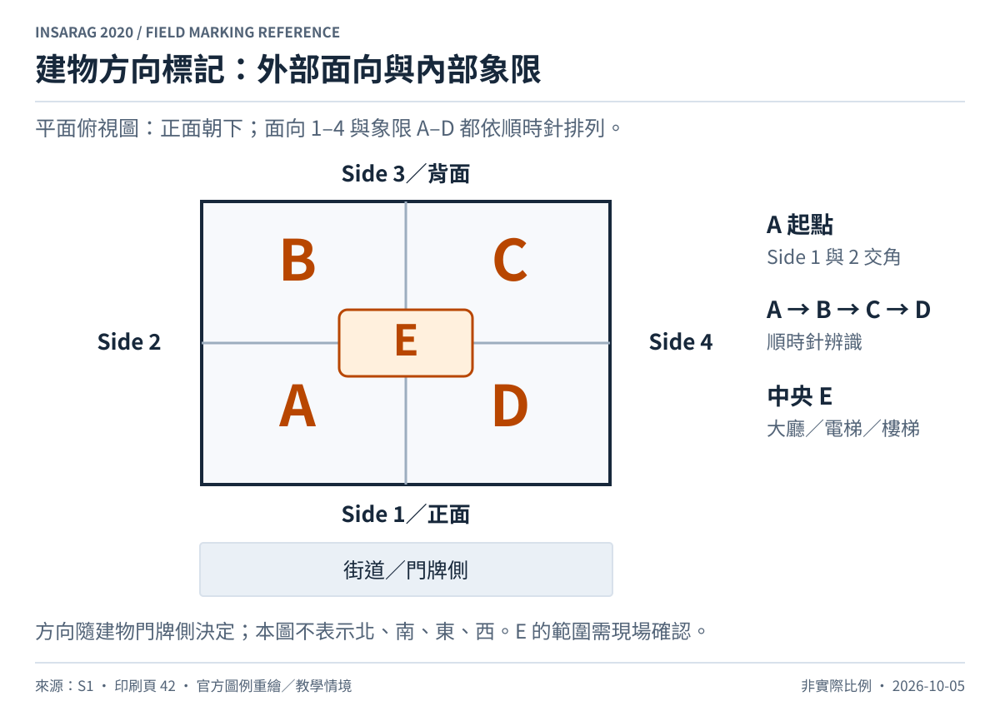
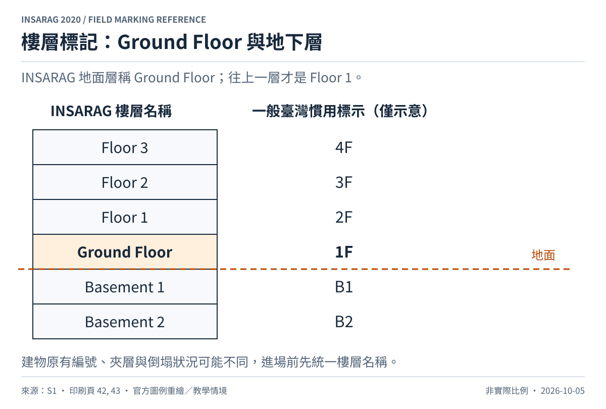
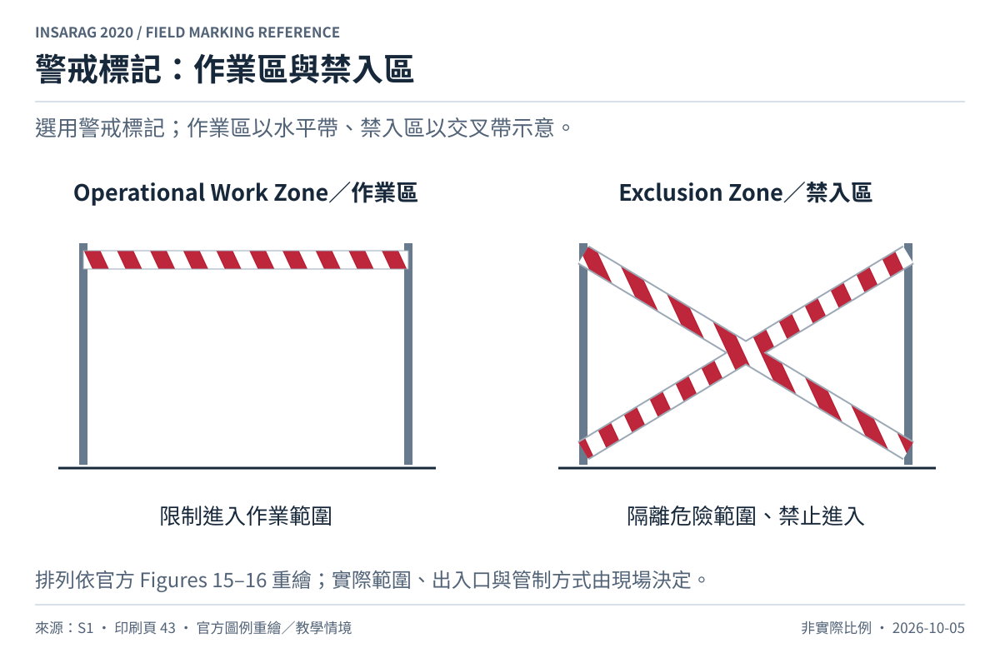

# 區域、建物方向、樓層與警戒標記

來源：[S1，第 6.1.1–6.1.3 節，pp.41–43，Figures 12–16](../sources/README.md)。以下皆為選用輔助標記。

## 一般區域

優先使用現有街名、門牌；無法辨識時使用所有隊伍一致採用的地標或名稱。場址仍須個別辨識；沒有地圖時，製作草圖並提供給 UCC／LEMA。[S1，§6.1.1，p.41](../sources/README.md)

## 建物面向與象限

面向街道、具有門牌的一側為 **Side 1／正面**，其餘依平面圖順時針編為 2、3、4。圖中正面置於下方，因此 2 在左、3 在上、4 在右；不能直接以看向建物時的左右代替編號。

室內由 Side 1 與 Side 2 相接角落開始，順時針分為 A、B、C、D。多樓層建物的中央大廳、電梯、樓梯等區域為 E。圖中 E 是中央區域示意，不是規定固定面積。[S1，§6.1.2，Figure 13，p.42](../sources/README.md)

## 樓層

地面層為 `Ground Floor`，往上一層為 `Floor 1`，再往上依序增加；地下第一層為 `Basement 1`。臺灣常用的 1F 往往是 Ground Floor，不能直接把臺灣 1F 抄成 INSARAG Floor 1。圖中的臺灣慣用樓層欄僅為一般情境對照，實際建物仍需現場確認。[S1，§6.1.2，pp.42–43，Figure 14](../sources/README.md)

## 警戒區

作業區（Operational Work Zone）用水平警戒帶表示；禁入區（Exclusion Zone）以交叉警戒帶表示。此圖重繪官方 Figures 15–16 的排列方式，現場仍須依實際危險範圍與動線設置管制。警戒帶排列與顏色不取代危害文字或現場指揮。[S1，§6.1.3，p.43](../sources/README.md)
