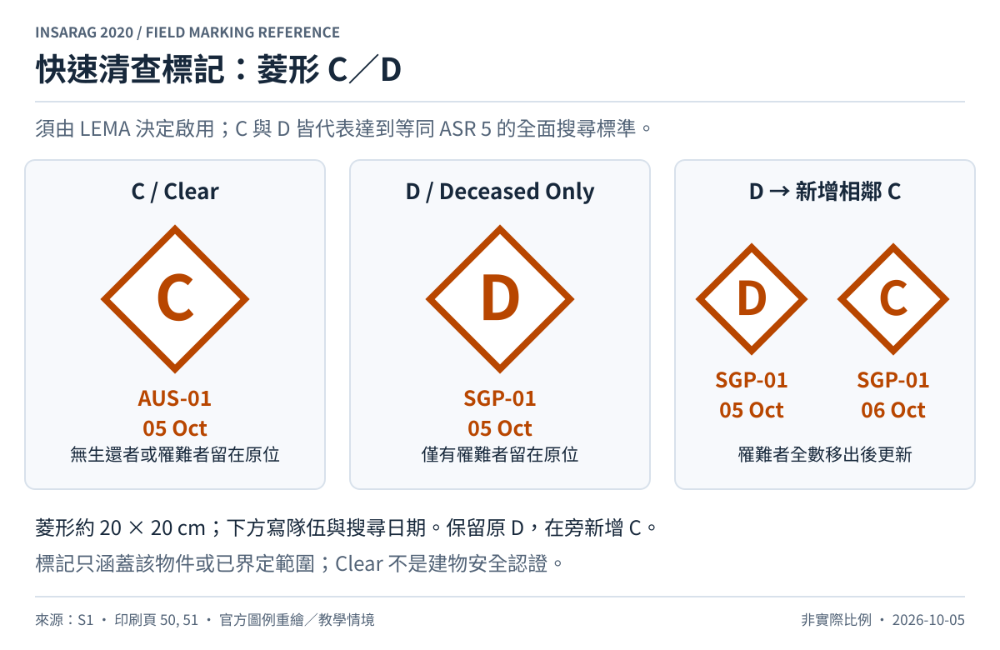

# 快速清查標記（RCM）

來源：[S1，第 6.3.3–6.3.5 節，pp.49–51，Table 11 與清查範圍圖例](../sources/README.md)；符號解讀亦見 [S2，Rapid Clearance Marking System 小節](../sources/README.md)。

## 何時使用

**2020 作業手冊要求由 LEMA 決定啟用。** 適用於能迅速完成全面搜尋的場址，或有強烈證據確認無法再進行存活者救援的情況。`C`、`D` 都是達到等同 ASR 5 全面搜尋標準的結果，不是一次快速目視檢查就可以畫上。[S1，§6.3.4，p.50](../sources/README.md)

| 符號 | 意義 | 還有哪些人在原位 |
| --- | --- | --- |
| 菱形 C | Clear：全面搜尋完成 | 無存活或死亡受困者 |
| 菱形 D | Deceased Only：同程度全面搜尋完成 | 僅有死亡受困者 |

## 畫法與範圍

畫菱形，內寫大寫 `C` 或 `D`，下方寫 Team ID 與搜尋日期。尺寸約 20 × 20 cm，使用與背景明顯對比的顏色。可標在建物、車輛、物件、附屬建物或瓦礫堆的顯眼處；區域標記須界定邊界。標在車上的 C 只代表該車，不會延伸到附近建物。[S1，§6.3.4–6.3.5，pp.50–51](../sources/README.md)

當 D 範圍內的死亡受困者全部移出後，在原標記旁**新增 C 標記**，附上本次隊伍與日期，保留原 D 標記供追蹤。[S1，Table 11，p.50](../sources/README.md)

RCM 的「Clear」是搜尋結果，不是結構安全、危害解除或允許一般民眾進入的認證。這是依符號定義作出的閱讀提醒；危害與進入管制仍需另行處理。
