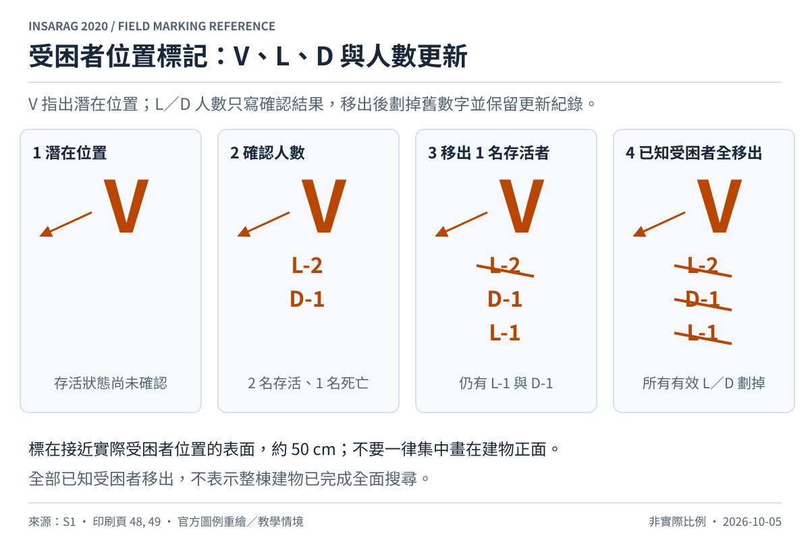

# 受困者位置標記

來源：[S1，第 6.3–6.3.2 節，pp.48–49，Table 10](../sources/README.md)。同樣規則可對照 [S2，Victim Marking 小節](../sources/README.md)。

在最接近受困者實際位置的表面畫大寫 `V`，必要時加箭頭。單獨的 `V` 表示潛在受困者位置，不表示已確認有生還者。確認後在下方寫 `L-n`（生還者）或 `D-n`（罹難者），`n` 為仍在該位置的人數；兩種資訊可以並存。

每移出一人，劃掉對應舊數字，將剩餘人數寫在下方。全部已知受困者都移出後，劃掉所有有效的 L／D 記錄；**保留 V 與變更痕跡**，不是把 V 改畫成 RCM 菱形。

| 圖中階段 | 解讀 |
| --- | --- |
| 1：V | 指出潛在受困者位置 |
| 2：L-2、D-1 | 確認 2 名生還者與 1 名罹難者 |
| 3：劃掉 L-2、補 L-1 | 已移出 1 名生還者，仍有 L-1 與 D-1 |
| 4：全部有效 L／D 劃掉 | 該位置所有已知受困者已移出 |

以上為自行編排的連續教學情境，規則依 Table 10。最後一階段只陳述「所有已知受困者已移出」，不能推論整棟建物或附近區域已達全面搜尋標準。

若搜索隊伍未留在現場立即展開作業、多人受困或位置容易混淆，應依指引設置此標記。標記約 50 cm，顏色與背景有明顯對比；不要把它統一畫在建物正面的 Worksite ID 旁，除非受困者就在那裡。它不是救援結束後才補畫的完成標記。[S1，§6.3.1，p.48](../sources/README.md)
