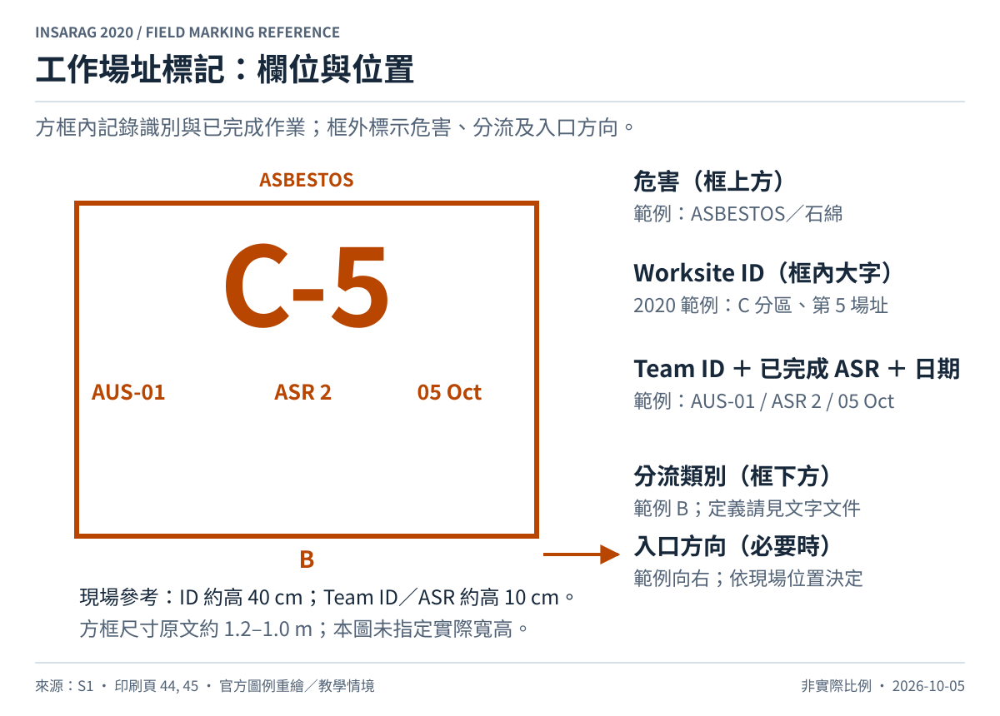
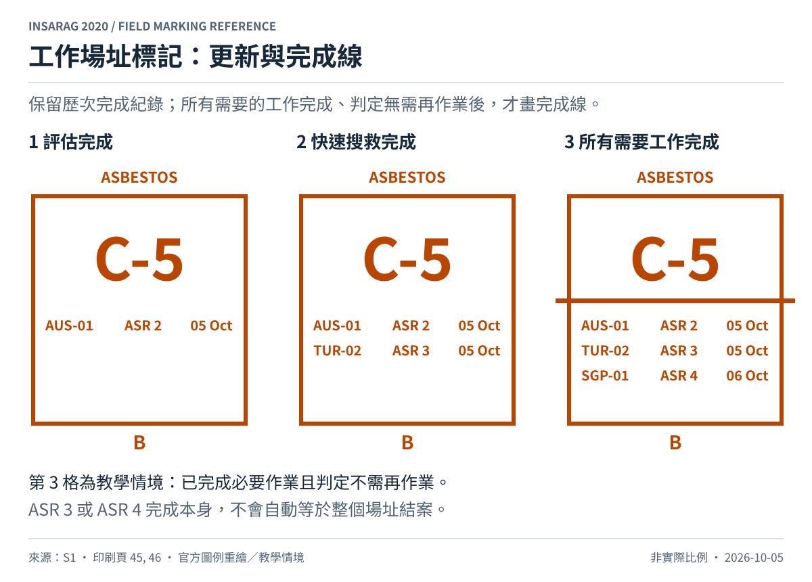

# 工作場址分流標記

來源：[S1，第 5.5.5、5.7、5.8、6.2 節，pp.26–27、29–35、44–47](../sources/README.md)。

## 畫法與欄位

ASR 2 評估確認為工作場址後，在入口附近的外牆或最顯眼處設置方框。框內以大字寫 Worksite ID，下面依序記錄 Team ID、**已完成**的 ASR Level 與日期。框上方寫危害，框下方寫分流類別；有需要時以箭頭指出實際場址或入口。新增完成的 ASR 作業時，加入隊伍、層級與日期，保留既有紀錄。[S1，§6.2，pp.44–45](../sources/README.md)

本圖使用 `C-5`，表示 2020 編碼的 C 分區、第 5 場址；細分場址可如 `C-12b`。**2027 新版編碼改為 Team ID 加四位數流水號**，請見 [版本核對](../sources/version-notes.md)，勿將本圖當作新版編碼範本。

## 分流類別

| 類別 | 受困者資訊 | 預估作業時間 |
| --- | --- | --- |
| A | 確認有存活受困者 | 少於 12 小時 |
| B | 確認有存活受困者 | 超過 12 小時 |
| C | 可能有存活受困者，尚未確認 | 未評估 |
| D | 僅有死亡受困者 | 未評估 |

來源：[S1，§5.8.1，Table 6，p.35](../sources/README.md)。原表沒有定義「恰好 12 小時」的歸類，本整理保留原文界線，演習時應由協調單位事先統一此邊界。這是工作場址分流，不是醫療傷患檢傷。

## ASR 與完成線

| 層級 | 名稱 | 讀取標記時的重點 |
| --- | --- | --- |
| ASR 1 | Wide Area Assessment／大範圍評估 | 建立受災區概況 |
| ASR 2 | Worksite Triage Assessment／工作場址分流評估 | 建立場址及分流資料 |
| ASR 3 | Rapid Search and Rescue／快速搜索與救援 | 完成此級作業後更新紀錄 |
| ASR 4 | Full Search and Rescue／完整搜索與救援 | 完成此級作業後更新紀錄 |
| ASR 5 | Total Coverage Search and Recovery／全面搜索與遺體尋回 | 全面涵蓋，不等同 ASR 3 或 ASR 4 |

來源：[S1，§5.7，pp.29–34](../sources/README.md)。ASR 不是固定依序走完的進度百分比。

所有需要的工作完成，而且判定不再需要作業時，才畫橫線穿越整個場址標記。2020 文字寫「穿越中央」；Figure 20 將線放在 ID 下、ASR 紀錄上。本圖依該圖例繪製。[S1，§6.2，p.45；Figure 20，p.46](../sources/README.md)

**ASR 3 完成不會自動觸發完成線。** 橫線也不是划掉危害或宣告結構安全。重要補充資訊應以清楚文字標示，並記錄於 Worksite Triage／Worksite Report，透過 ICMS 回報。[S1，§6.2，p.45](../sources/README.md)
