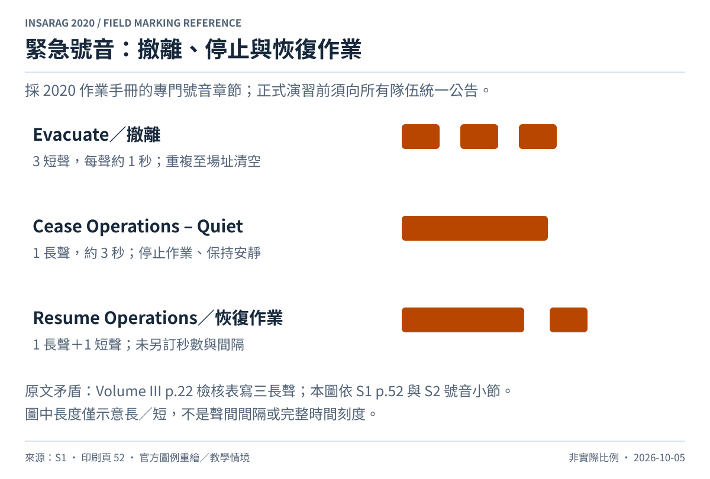

# 緊急號音附錄

這是與標記章節相鄰的補充內容。基準：[S1，§6.4，p.52，Figures 24–26](../sources/README.md)；交叉核對：[S2，INSARAG Signalling 小節](../sources/README.md)。

| 指令 | 號音 | 反應 |
| --- | --- | --- |
| Evacuate／撤離 | 3 短聲，每聲約 1 秒；持續重複至場址清空 | 立即依撤離計畫離開 |
| Cease Operations – Quiet／停止作業、保持安靜 | 1 長聲，約 3 秒 | 停止作業、保持安靜 |
| Resume Operations／恢復作業 | 1 長聲＋1 短聲 | 依現場指令恢復作業 |

來源只在前兩種號音明訂秒數；圖中「恢復作業」只標長／短，不額外指定秒數或聲間間隔。可使用氣笛或其他適當發聲裝置，作業前須向所有隊伍成員說明一致的號音及立即反應要求。

**來源衝突待現場採用單位確認：** S3（2020 Volume III）p.22 的救援檢核表寫撤離用「three longs horn blasts」，與 S1 p.52 及 S2 的 INSARAG Signalling 小節之「三短聲」不同。本圖採專門號音章節及附件一致的三短聲規則，未將檢核表的三長聲混入。此差異已列於 [版本核對](../sources/version-notes.md)，正式演習前應由主辦單位確認並統一公告。
